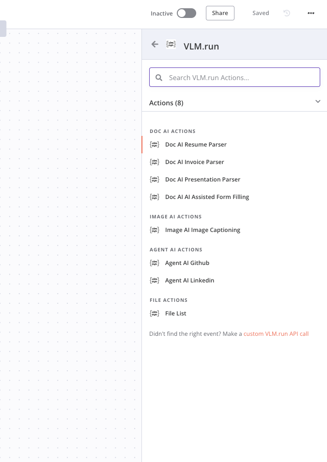
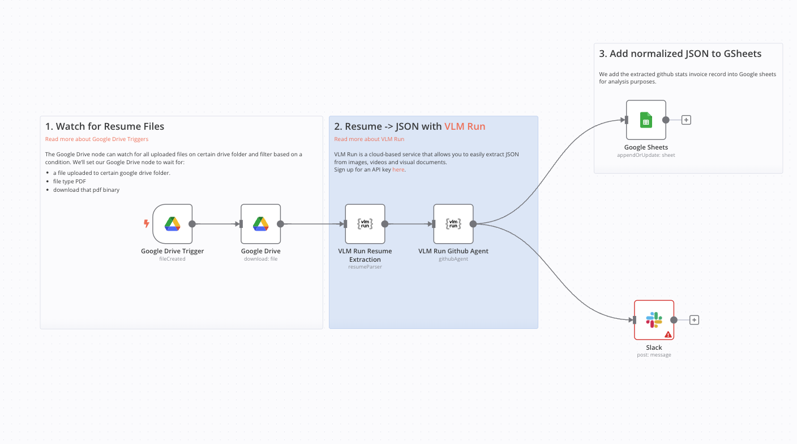

# n8n-nodes-vlmrun

This repo contains custom [n8n](n8n.io) nodes for [VLM Run](https://vlm.run).

## Prerequisites

You need the following installed on your development machine:

- [git](https://git-scm.com/downloads)
- Node.js and pnpm. Minimum version Node 18. You can find instructions on how to install both using nvm (Node Version Manager) for Linux, Mac, and WSL [here](https://github.com/nvm-sh/nvm). For Windows users, refer to Microsoft's guide to [Install NodeJS on Windows](https://docs.microsoft.com/en-us/windows/dev-environment/javascript/nodejs-on-windows).
- Install n8n with:
  ```
  pnpm install n8n -g
  ```
- Recommended: follow n8n's guide to [set up your development environment](https://docs.n8n.io/integrations/creating-nodes/build/node-development-environment/).

## Using this starter

These are the basic steps for working with the starter. For detailed guidance on creating and publishing nodes, refer to the [documentation](https://docs.n8n.io/integrations/creating-nodes/).

1. [Generate a new repository](https://github.com/n8n-io/n8n-nodes-starter/generate) from this template repository.
2. Clone your new repo:
   ```
   git clone git@github.com:autonomi-ai/n8n-nodes-vlmrun.git
   ```
3. Run `pnpm i` to install dependencies.
4. Open the project in your editor.
5. Browse the examples in `/nodes` and `/credentials`. Modify the examples, or replace them with your own nodes.
6. Update the `package.json` to match your details.
7. Run `pnpm lint` to check for errors or `pnpm lintfix` to automatically fix errors when possible.
8. Test your node locally. Refer to [Run your node locally](https://docs.n8n.io/integrations/creating-nodes/test/run-node-locally/) for guidance.

```
export VLMRUN_API_BASE_URL='https://api.vlm.run/v1'
echo $VLMRUN_API_BASE_URL
(n8n-nodes-vlmrun)
pnpm run build
pnpm link --global

n8n
cd ~/.n8n
mkdir custom
cd custom
pnpm init
pnpm link --global @vlm-run/n8n-nodes-vlmrun

(restart n8n)
n8n
(search for VlmRun)
```

9. Replace this README with documentation for your node. Use the [README_TEMPLATE](README_TEMPLATE.md) to get started.
10. Update the LICENSE file to use your details.
11. [Publish](https://docs.npmjs.com/packages-and-modules/contributing-packages-to-the-registry) your package to npm.

## More information

Refer to our [documentation on creating nodes](https://docs.n8n.io/integrations/creating-nodes/) for detailed information on building your own nodes.

## Screenshots

Here are some screenshots of the n8n-nodes-vlmrun in action:


_Overview of the VLM Run node in n8n_


_Example workflow using the VLM Run node_

## License

[MIT](https://github.com/n8n-io/n8n-nodes-starter/blob/master/LICENSE.md)
